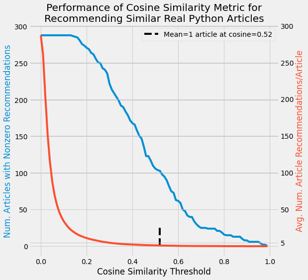

# rprec (Real Python Recommender)

## Content Recommendation Engine for Real Python

This app scrapes text from Real Python content daily. Raw text and metadata are stored in a Postgres database on deployed to heroku. The text is processed using a natural langauge processing (NLP) pipeline using [`spacy`](https://spacy.io/) then fed a cosine similarity model developed in [`scikit-learn`](https://scikit-learn.org/stable/) as well as a doc2vec model using [`gensim`](https://radimrehurek.com/gensim/). The top three most simliar articles (or content) are stored in the database. Using [`fastapi`](https://fastapi.tiangolo.com/), an API is available to interaction with the database.  

The utility of this app can be realized in a Google Chrome extension, [Real Python Content Recommender](https://github.com/arvkevi/rprec-chrome-extension), available in the [Chrome Web Store](). Once installed, the Chrome extension allows the user to click a button when they are on a Real Python page to see the top 3 most similar articles to the one they are currently reading.




### Installation

```bash
git clone https://github.com/arvkevi/rprec.git
cd rprec
python setup.py install
```

### Usage

There are currently two functions from the command line, `scraper` and `recommender`.
1. Scrape Real Python tutorial articles and store the text in the database.
2. Vectorize each article, perform cosine similarity of each, store the top 5 in the database.

#### local setup
Create a postgres database using the schema provided:

```bash
createdb rprecdb
psql -U username rprecdb < schema.sql
```

#### srape
The `scraper` command will scrape all of the Real Python tutorial articles and store the text in the database.
```bash
rprec scraper --database-name=rprecdb --database-user=kevin database_server=localhost
```

#### recommend
The `recommender` command has two modes controlled by the boolean parameter, `--scrape`. The default, `--scrape=True`, will scrape Real Python for new articles that are not yet in the database. You can set `--scrape=False` to only perform cosine similarity for the Real Python articles that are currently in the database. 

The Recommender vectorizes each article using term frequency-inverse document frequency (tf-idf), performs cosine similarity on the article vectors pairwise, for each article, finally, it stores these similarity scores in the `similar_articles` table in the database.

```bash
rprec recommender --database-name=rprecdb --database-user=kevin database_host=localhost --scrape=True
```

### Query results
Check out the five most similar titles (slugs):

```bash
psql rprecdb
```

```sql
SELECT slug, similar_slug, cosine_similarity FROM similar_articles
WHERE slug = 'logistic-regression-python';
```

|            slug            |           similar_slug           | cosine_similarity |
|----------------------------|----------------------------------|-------------------|
| logistic-regression-python | linear-regression-in-python      |        0.615 |
| logistic-regression-python | python-keras-text-classification |        0.394 |
| logistic-regression-python | numpy-tensorflow-performance     |        0.303 |
| logistic-regression-python | list-comprehension-python        |        0.224 |
| logistic-regression-python | matlab-vs-python                 |        0.221 |

